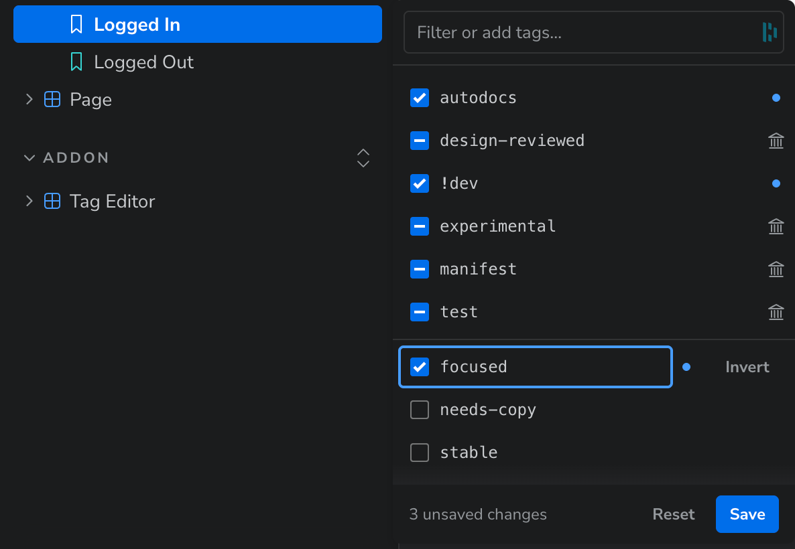

<div align="center">
  <picture style="display: flex; flex-direction: column; align-items: center;">
    <source src="./static/addon-example.avif" type="image/avif" />
    
  </picture>

  <h1>Storybook Addon - Tag Editor</h1>

  <p>
    This addon lets you edit <a href="https://storybook.js.org/docs/writing-stories/tags">tags</a> for a story, component or docs page from the Storybook <a href="https://storybook.js.org/docs/configure/user-interface/sidebar-and-urls">sidebar</a>. Open the context menu of a sidebar entry and pick <strong>Edit tags</strong>. A popover lets you add, remove or invert tags, and the addon writes your changes back to the source file.
  </p>

  <p>
    
    <a href="https://github.com/Sidnioulz/storybook-addon-tag-editor/commits"></a>
    <a href="https://github.com/Sidnioulz/storybook-addon-tag-editor/commits"></a>
    <a href="https://github.com/Sidnioulz/storybook-addon-tag-editor/issues/"></a>
    <a href="https://github.com/Sidnioulz/storybook-addon-tag-editor/actions/workflows/codeql.yml"></a>
    <a href="https://github.com/Sidnioulz/storybook-addon-tag-editor/actions/workflows/build.yml"></a>
    <a href="https://codecov.io/gh/Sidnioulz/storybook-addon-tag-editor"></a>
    <a href="https://github.com/Sidnioulz/storybook-addon-tag-editor/graphs/contributors"></a>
    <a href="https://github.com/Sidnioulz/storybook-addon-tag-editor/blob/main/CODE_OF_CONDUCT.md"></a>
    <a href="https://github.com/Sidnioulz/storybook-addon-tag-editor/blob/main/LICENSE"></a>
    <a href="https://github.com/Sidnioulz/storybook-addon-tag-editor/network/members"></a>
    <a href="https://github.com/Sidnioulz/storybook-addon-tag-editor/stargazers"></a>
    <a href="https://github.com/sponsors/Sidnioulz"></a>
  </p>
</div>

---

## 📔 Table of Contents

<!-- no toc -->

- [📔 Table of Contents](#-table-of-contents)
- [📦 Installation](#-installation)
- [👀 Usage](#-usage)
- [🐌 Limitations](#-limitations)
  - [Dev Mode Only](#dev-mode-only)
  - [Static Tags and Default CSF Only](#static-tags-and-default-csf-only)
  - [Formatting](#formatting)
- [👩🏽‍💻 Contributing](#-contributing)
  - [Code of Conduct](#code-of-conduct)
  - [Developer Certificate of Origin](#developer-certificate-of-origin)
  - [Getting Started](#getting-started)
  - [Useful commands](#useful-commands)
  - [Release System](#release-system)
- [🆘 Support](#-support)
- [✉️ Contact](#️-contact)
- [💛 Acknowledgments](#-acknowledgments)
  - [Thanks](#thanks)
  - [Built With](#built-with)

## 📦 Installation

<!-- Begin temporary release notice -->

> [!IMPORTANT]
> It also uses the sidebar context menu API from [storybook#36316](https://github.com/storybookjs/storybook/pull/36316), which is not released yet. Until it ships, you need a canary build of Storybook.

<!-- prettier-ignore -->
```jsonc
// package.json
{
  "devDependencies": {
    "storybook": "https://pkg.pr.new/storybook@aa7e796",
    "@storybook/react-vite": "https://pkg.pr.new/@storybook/react-vite@aa7e796"
  }
}
```

----
<!-- End temporary release notice -->


This addon needs Storybook 11 and Node 22.12 or later. Install it in one step with the Storybook CLI:

```sh
pnpx storybook add storybook-addon-tag-editor
```

Or install it manually, by adding the development dependency and editing `main.ts` and `preview.ts`:
```sh
pnpm add -D storybook-addon-tag-editor
```

Register the addon in `.storybook/main.ts`:

```ts
// .storybook/main.ts
import { defineMain } from '@storybook/react-vite/node';

export default defineMain({
  addons: ['storybook-addon-tag-editor'],
});
```

And in `.storybook/preview.ts`, alongside your other addons:

```ts
// .storybook/preview.ts
import { definePreview } from '@storybook/react-vite';
import tagEditor from 'storybook-addon-tag-editor';

export default definePreview({
  addons: [tagEditor()],
});
```

## 👀 Usage

Hover or focus a docs page, component or story in the sidebar, open its context menu, and pick **Edit tags**. Note that component autodocs do not have tags, so the menu option is missing for those entries.

The editor UI lets you add, remove and invert tags, and create new tags. It shows tags inherited from a parent component or the global preview configuration.

Please provide feedback if you or your users find it difficult to understand and use the editor UI.

## 🐌 Limitations

### Dev Mode Only

Storybook renders the sidebar context menu in development only, so the addon does nothing in a built Storybook.

### Static Tags and Default CSF Only

The addon reads and writes tags with [`csf-tools`](https://github.com/storybookjs/storybook/tree/next/code/core/src/csf-tools) for CSF files and [remark](https://remark.js.org/) for MDX. Both need a literal array of strings.

Tags injected into stories via the [Indexer API](https://storybook.js.org/docs/api/main-config/main-config-indexers) can be edited, but edits will not persist as they are not actually derived from CSF files. Custom CSF formats like [Svelte CSF](https://github.com/storybookjs/addon-svelte-csf) are not supported.

### Formatting

`csf-tools` is unaware of your formatting and linting preferences. Run your formatter after editing tags in the UI and prior to committing your changes.

## 👩🏽‍💻 Contributing

### Code of Conduct

Please read the [Code of Conduct](https://github.com/Sidnioulz/storybook-addon-tag-editor/blob/main/CODE_OF_CONDUCT.md) first.

### Developer Certificate of Origin

To ensure that contributors are legally allowed to share the content they contribute under the license terms of this project, contributors must adhere to the [Developer Certificate of Origin](https://developercertificate.org/) (DCO). All contributions made must be signed to satisfy the DCO. This is handled by a Pull Request check.

> By signing your commits, you attest to the following:
>
> 1. The contribution was created in whole or in part by you and you have the right to submit it under the open source license indicated in the file; or
> 2. The contribution is based upon previous work that, to the best of your knowledge, is covered under an appropriate open source license and you have the right under that license to submit that work with modifications, whether created in whole or in part by you, under the same open source license (unless you are permitted to submit under a different license), as indicated in the file; or
> 3. The contribution was provided directly to you by some other person who certified 1., 2. or 3. and you have not modified it.
> 4. You understand and agree that this project and the contribution are public and that a record of the contribution (including all personal information you submit with it, including your sign-off) is maintained indefinitely and may be redistributed consistent with this project or the open source license(s) involved.

### Getting Started

This project uses PNPM as a package manager, and needs Node 22.12 or later.

- See the [installation instructions for PNPM](https://pnpm.io/installation)
- Run `pnpm i`

### Useful commands

- `pnpm start` builds the addon in watch mode and starts the local Storybook
- `pnpm build` builds and packages the addon code
- `pnpm test` runs the test suite, `pnpm test:coverage` adds a coverage report
- `pnpm check` type-checks the source
- `pnpm lint` runs ESLint and Prettier

### Release System

This package auto-releases on pushes to `main` with [semantic-release](https://github.com/semantic-release/semantic-release). No changelog is maintained and the version number in `package.json` is not synchronised.

## 🆘 Support

Please [open an issue](https://github.com/Sidnioulz/storybook-addon-tag-editor/issues/new) for bug reports or code suggestions. Make sure to include a working Minimal Working Example for bug reports.

## ✉️ Contact

Steve Dodier-Lazaro · `@Frog` on the [Storybook Discord](https://discord.gg/storybook) - [LinkedIn](https://www.linkedin.com/in/stevedodierlazaro/)

Project Link: [https://github.com/Sidnioulz/storybook-addon-tag-editor](https://github.com/Sidnioulz/storybook-addon-tag-editor)

## 💛 Acknowledgments

### Thanks

- [Stefan Ganswint](https://github.com/StefanG1102) for creating the first prototype of a tag editor
- All the contributors to the [Storybook addon kit](https://github.com/storybookjs/addon-kit)

### Built With

[](https://github.com/dependabot)
[](https://eslint.org/)
[](https://github.com/solutions/ci-cd)
[](https://prettier.io/)
[](https://remark.js.org/)
[](https://github.com/semantic-release/semantic-release)
[](https://storybook.js.org/)
[](https://tsup.egoist.dev/)
[](https://www.typescriptlang.org/)
[](https://vitest.dev/)
